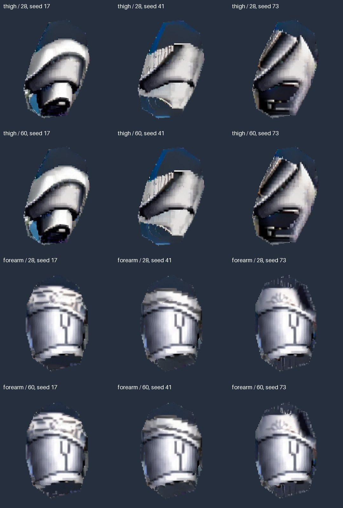
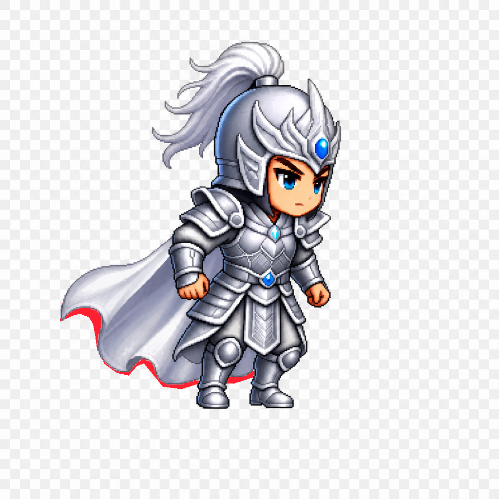
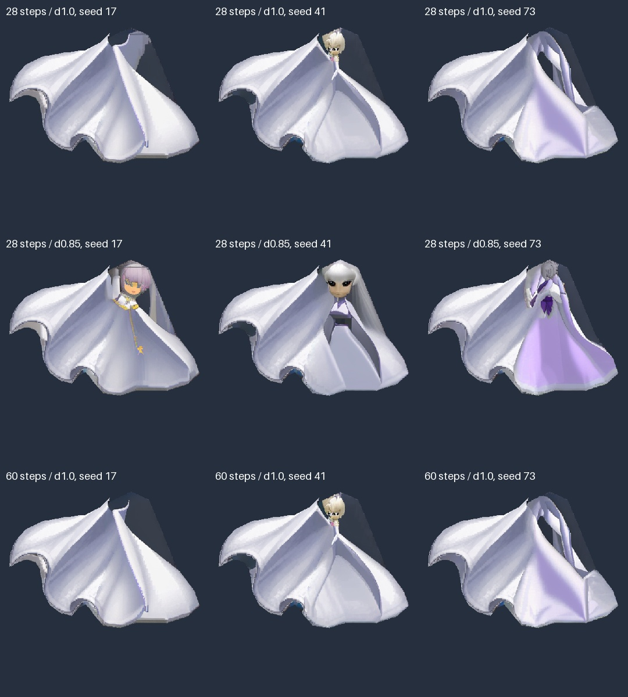

# 赵云 GPU 补绘复核与下一轮方案

复核基线：`c6643ac`，2026-09-03；新站立图 SHA256 为 `5b952c09b024…`。本次解包检查实际 PNG、工作流和报告，在本地重算指标，没有重新运行生成模型。证据见 [复核包](../_artifacts/comfy-inpaint/zhaoyun-v2-review-c6643ac/README.md)。

2026-09-04 执行顺序更新：先按 [Krita AI 实施方案](KRITA_AI_GPU_TEST_PLAN.zh-CN.md) 做 18 张 SDXL 对照；本文的输入、内容与装配问题继续作为验收依据，原第三步的 36 张 SD2 扫描暂缓。该更新是试验计划，不是新增跑测结论。

**结论：推理、像素保护和 Photopea 坐标回贴已经可用；三个推荐补全部件均不能直接按最终绑定素材验收。主要问题是材质没有覆盖目标轮廓、披风轮廓越界、生成语义失控，以及组装检查被整张原图遮挡。下一步先修正验收和输入，再做有界 GPU 对照。**

## 1. 已证实的进展

| 检查 | 本地复核结果 | 含义 |
| --- | --- | --- |
| 原矩阵 | 12/12 技术门通过 | 模型执行、原生像素保护、Alpha 合成有效 |
| 参数轮次和探针 | 12 个参数候选 + 1 个探针通过；合计 25/25 | 重算实际 PNG 与原技术报告一致 |
| 披风纹理对照 | seed 17/41/73 的蒙版内 RGB MAE 为 8.353/7.373/7.666 | 小块纹理修复有效；41 保留作对照，不代表完全无接缝 |
| 坐标回贴 | 按裁片坐标重组的 RGBA 与 `parts_only.png` 精确一致 | `placement.json` 坐标可复用 |
| GPU 运行 | H20 原矩阵客户端耗时 2.008–2.276 秒，抽样显存最高 3.19 GB | 问题没有表现为显存不足或模型无法运行 |

包含参数轮次时，抽样显存最高约 3.33 GB。耗时含轮询，显存为抽样值，不是精确模型耗时/瞬时峰值，也不能直接外推其他显卡。`comfy-mcp`、完整新图 PSD、Spine 导入与动作仍未验证。

## 2. 当前问题

### P0：Alpha 满覆盖，但 RGB 材质没有填满

模型会在允许编辑区继续画深色背景。随后用目标轮廓强制设置 Alpha=255，这些背景成为附件的一部分。因此 `nativeAlphaMatchesTarget=true` 无法发现“目标里仍不是部件材质”。

下表在原生尺寸统计编辑区中接近输入底色 `#303947` 的像素：逐通道最大差值 ≤12。

| 推荐候选 | 编辑区近底色像素 | 比例 | 观察 |
| --- | --- | --- | --- |
| 披风 / 60 steps / seed 17 | 9,222 / 48,650 | 18.96% | 右上方大块深色区域，布料未覆盖完整目标 |
| 大腿 / 28 steps / seed 17 | 1,153 / 5,704 | 20.21% | 髋端和侧边存在背景块，完整髋膝体积不成立 |
| 前臂 / 28 steps / seed 17 | 174 / 2,700 | 6.44% | 肘腕端仍有深色块、条纹，完整连接面未获证明 |

以上像素全部为 Alpha 255。该比例是诊断线索，合法阴影也可能接近底色，不能当作精确空洞比例，更不能按该颜色抠透明来“修复”。需要与几何和材质证据联合判断。

### P0：全不透明参考图使组装检查失去意义

原图 Alpha 最小值和最大值都是 255，棋盘格也在 RGB 中。归档记载把候选放在整张原图下方，所以整个候选都会被盖住。复核用任意橙色整图作为错误底层，仍然得到与原图零差异的结果。

因此 `assembledVsSourcePixelDiff=0` 不能证明补绘、层级或动作正确。坐标校验仍有效，必须与这个被遮挡的组装比较分开报告。

进一步对比已有粗抠前景，披风候选有 **3,707 个像素超出近似人物轮廓**，大腿和前臂为 0。最大三块为 1,564、1,463、586 像素，原图对应位置大量是 238/253 等灰白棋盘格像素。数量受粗抠图误差影响，但明显外扩边带要求重审披风目标轮廓。原记录的“0 像素侵入背景”不足以作为验收依据。

这也暴露了初版测试设计的不足：人工轮廓较粗，检查只保护像素和 Alpha，未要求材质填满，也没有验证真实前景分层后的叠合。不能把这些问题全部归因于 GPU 模型。

### P1：披风被解释为穿披风的人物

原矩阵 seed 41、60 steps 的 seed 41，以及 denoise 0.85 的三个 seed 都出现了人物。增加 steps 没有消除问题。seed 73 的“开口”也可能是目标内部的深色 RGB，并非 Alpha 真有透明裂缝。

提示词包含角色/游戏与披风语义，可见布料证据又不足，这些是可能的诱因，尚未通过单变量实验确认。白色 inpaint mask 指定允许修改的位置，不保证全部位置都成为布料，需要额外的形状和材质约束。[Diffusers 官方说明](https://huggingface.co/docs/diffusers/using-diffusers/inpaint)

“denoise < 1 都失败，所以必须用 1.0”应收窄：本次只验证 0.85 的三个 seed 失败。下一轮暂时固定 1.0，不能把这一次结果推广成通用规律。

### P1：部件尺度小，细节不等于结构改善

大腿、前臂目标面积分别只占 512 工作图约 11.1%、8.6%。大腿约 78% 的目标还没有可见原画，直接从小纹理片要求生成完整腿部容易产生不明铠甲结构。

60 与 28 steps 的大腿/前臂 seed 17 在编辑区 RGB MAE 约为 3.16/3.41，却没有消除背景块；披风 seed 17 的近底色比例由 12.46% 升到 18.96%。因此“60 steps 最佳”最多是局部褶皱观感判断，不能决定最终候选。

### P1：已有骨骼测试不覆盖本图与目标动作

同期 SAM/V3 rig 属于另一张图：`profiles/zhaoyun/prompts.json` 的源哈希是 `edbe1d7c…`，不能当作这张 `5b952c09…` 新图的验证。

已有 `spinetools/rig/rotation.py` 只测 -15/0/+15°，裂缝指标主要依赖 Alpha；即使适配到新图，也会漏掉不透明背景块。奔跑最大跨步、战斗挥枪需要目标动作和中间采样。

## 3. 下一步实施顺序

以下是待实施任务，不是已经可运行的新 CLI。复用 AC-02 契约，优先落实 AC-04/05/06/08/09 的必要部分；没有将这些任务标为 DONE。

### 第一步：让已知错误样本确实失败（CPU，P0）

1. 分开输出 `integrityPassed`、`appearancePassed`、`assemblyPassed`、`motionPassed`。保留原画 RGBA 零改动与 Alpha 范围检查。
2. 必拒负例：空补图、整块背景色附件、灰色占位、人头披风、错误偏移、完整原图覆盖全部部件。近底色统计与局部材质/形状证据结合，不机械排除所有暗色。
3. 正例包含完整可见护臂、披风和真实深色阴影。用已知可见区域制造遮挡，划分开发/留出集；评测阈值在看留出集前冻结，真值不得进入生成或选优输入。
4. 装配与动作导出时隐藏完整参考图，只保留真实部件层。输出黑、白、彩色三种底板和单部件无遮挡图。无法确认语义的候选自动拒收或有界重试，不靠人工等待冒充流水线完成。

交付：内容质量报告、负例检查、无遮盖装配预览。以上已知坏样本必须被拦截，合法深色阴影应通过。

### 第二步：修正轮廓，建立材质基础（CPU，P0）

- 建立独立 `zhaoyun-v3` 案例，保留 v2 及失败样本。重新确定披风可见外缘、身体/腿部真实遮挡区；新增隐藏像素在 setup 中必须被真实前景部件遮挡，不能靠棋盘格原图。
- 大腿、前臂、未来枪杆优先用骨轴、截面、圆盘/胶囊等确定性几何，再移植本部件可见材质。披风沿可见褶皱方向延展纹理作为基础。变换、来源和不确定性均记录，隐藏内容仍为推测。
- 分离 `sourceKeep`（原画保护）、`repairGuide`（推测几何/材质）、`editMask`、`targetAlpha` 及前景遮挡关系。推测像素不能伪装成原画像素。
- 模型主要处理新增材质里的接缝和不确定纹理，避免把整个灰色空白部件完全重画。指导像素必须实际进入模型条件；把材质基础全部放在白色编辑 mask 内再以 denoise 1.0 重画，不等于有效引导。
- 紧裁剪采用目标 bbox 加约 16 原图像素 padding，保持等比并补方形，使目标最长边约占工作图 70–85%。推理后回到原生尺度恢复 `sourceKeep`，保存 crop/scale/pivot 变换。

交付：新版输入配方、几何/材质候选、允许编辑区、像素来源图、坐标校验。先证明已不单靠灰色空白表达形状，再进入 GPU。不能缩小目标动作范围来掩盖缺口。

### 第三步：同模型做 36 个有界候选（H20，P1）

第二步输出冻结后，三个真实补全部件统一使用相同的源图、修正轮廓、材质基础和保护契约，只比较紧裁剪与提示词两个变量：

| 配置 | 工作裁剪 | 提示词 | 任务数 |
| --- | --- | --- | --- |
| A | 原宽裁剪 | 原提示词 | 3 部件 × seed 17/41/73 = 9 |
| B | 紧裁剪 | 原提示词 | 9 |
| C | 原宽裁剪 | 材质/几何提示词 | 9 |
| D | 紧裁剪 | 材质/几何提示词 | 9 |

固定当前已下载模型、28 steps、CFG 7、Euler/normal、denoise 1.0、batch=1。A 也须重新跑，因为轮廓/材质基础已经变更，旧归档不再是严格对照。每个部件最多 12 个候选；全失败即结束并归档，不追加 seed。

材质提示词由元数据生成：披风描述连续银白布片和灰紫褶皱，去掉人物/职业描述；前臂描述短圆柱银色护臂与完整肘腕连接面；大腿描述髋到膝之间的短粗腿部材质。几何仍靠明确约束，不只依赖文字。

主指标：各类部件内容通过率、接缝、材质覆盖、原生风格与动作暴露后的缺陷。MAE、近底色比例、耗时/显存辅助判断。先过门再排序，不能挑一张局部好看的图跳过验收。

若仍失败，再单独评估 [SDXL 专用 Inpainting](https://huggingface.co/diffusers/stable-diffusion-xl-1.0-inpainting-0.1) 的独立工作流；它只是候选，仍使用同一质量门并锁定版本。局部纹理可对照 [LaMa](https://github.com/advimman/lama)，不让其承担完整人体结构预测。当前不先换更多模型或引入云服务。

### 第四步：通过后扩为完整 PSD 与动作（CPU/Spine，P1）

1. 给新图建立完整部件及骨骼关系。参考整图隐藏；替换一个部件时移除其原可见层，避免原画像素盖住错误候选。
2. 保留 -15/0/+15° 基础测试，另按奔跑视频计算最大动作幅度并覆盖中间姿态；没有目标视频的动作只能标作设计应力范围，不能声称覆盖任意战斗。
3. 同时查几何裂缝和 RGB 材质异常。先轻量部件变换预览，再实际 Spine 导入/运行库动画；导入成功不等于美术通过。
4. 武器用独立持枪参考建立枪头、枪杆、缨尾与双手约束。不能从空手新图验证武器，也不能排除武器后称为完整战斗绑定。

## 4. 本轮决策

保留 ComfyUI 推理、原画像素恢复及 Photopea 回贴链路。披风对照 seed 41 保留作纹理基线；三个推荐补全部件保留作研究候选，不作为最终绑定输入。

执行顺序为：**内容验收和无遮盖装配 → 几何/材质基础及新配方 → 36 个对照候选 → 完整 PSD 与动作**。暂不扩大 steps/seed 扫描，也不直接进入整个人物动画制作。

新版 GPU 入口应归档输入/指导图/蒙版、模型哈希、实际 ComfyUI commit、所有候选与拒绝原因、三底色及动态预览、每阶段独立结论。实现完成前，不把本方案视为已跑通结果。
