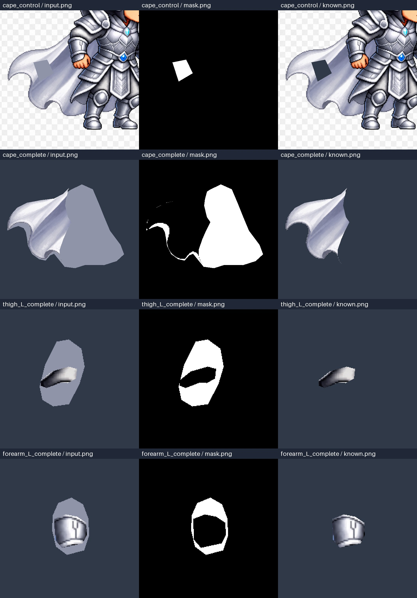

# 赵云新图：ComfyUI 局部补绘 GPU 测试方案

目标是验证：把 Photopea MCP 切出的不完整部件交给本地 ComfyUI，能否补出与原画一致的纹理、被遮挡形状及关节重叠区，再回到 Photopea 组装 PSD，供 Spine 绑定。

本次已提交新原图、四组输入/蒙版、提示词、四份 API 工作流及跨平台运行脚本。原图处理和测试素材导出实际使用了 Photopea MCP；ComfyUI 的上传、执行、下载和合成链路已在 CPU 模式验证。**生成模型尚未运行，补绘画质、GPU 性能和新图的 Spine 动作均待 GPU 环境测试。**

## 1. 新图与测试范围

使用 [source.png](../examples/comfy-inpaint/zhaoyun-v2/source.png)，即本次提供的 1024 × 1024 站立赵云图。文件 SHA256：

```text
5b952c09b0240b017c7d0107da02e7f7e5247c10f5d0c60f01ec83e2b7d7b988
```

它与之前奔跑视频首帧的姿势不同，已重新标注，没有沿用旧 PSD 的部件坐标。图中棋盘格是实际像素，不是真透明背景。`character-transparent.png` 是通过几何选区得到的粗抠图参考，白色头发、披风边缘仍需复核，不作为最终生产级 Alpha。



| 测试 ID | 内容 | 希望回答的问题 |
| --- | --- | --- |
| `cape_control` | 遮住原来可见的一小块披风，保留原图作为 ground truth | 模型能否延续已知褶皱、色彩和像素风格？ |
| `cape_complete` | 保留左侧披风纹理，补齐人物遮挡的右侧及连接处 | 大面积未知纹理能否保持一致，避免长出人物或铠甲？ |
| `thigh_L_complete` | 保留画面左侧大腿可见纹理，补髋端和膝端 | 能否形成完整体积，旋转时不露出透明断面？ |
| `forearm_L_complete` | 保留画面左侧前臂护甲，补肘端和腕端 | 护臂高光、结构和接缝能否延续？ |

`L` 表示画面左侧。补全轮廓和 pivot 是当前姿势下的人工假设，隐藏部分没有真实答案；第一组则有已知原画可对照。披风补全约 60% 的目标面积、大腿约 78%、前臂约 48%，难度显著高于第一组局部纹理修复。第一组保留整块参考画面，因此其输出是测试裁片，不是可直接导入 Spine 的透明披风。

这张新图没有武器。本轮测试不包含武器生成。后续沿用最初持枪图的武器参考，单独处理枪头、枪杆、缨尾，以及被手掌挡住的枪杆；不能从这张空手图验证武器结构。

## 2. 补绘的约束

处理顺序：原图/动作参考 → 部件切分 → 明确可见纹理与缺失区域 → ComfyUI 局部补绘 → 恢复原像素及 Alpha → Photopea 分层 PSD → Spine 动作检验。

- `input.png`：512 × 512 模型输入；灰色占位表示待补区域，深色为独立部件背景。
- `mask.png`：**白色允许重画，黑色必须保留**。使用 `LoadImageMask(channel="red")`。这里不能读取 PNG 的 Alpha 通道，否则不透明黑白蒙版会被误读。
- `keep-mask.png` / `known.png`：已确认的原画纹理；`target-alpha.png`：目标不透明轮廓。编辑区与保留区不重叠，两者并集正好等于目标轮廓。
- `reference-native.png`：原图精确裁片；`reference-model.png`：Photopea 放大后的工作参考。手臂/大腿原生裁片为 256 × 256，放大到 512 供模型使用，放大不代表有更多原始细节。
- VAE 解码可能改变黑色蒙版内的像素。工作流先在 512 分辨率强制回贴保留区，再缩回原生尺寸并回贴原始像素，避免生成结果悄悄改变原画。
- 输出 Alpha 由独立轮廓决定，避免棋盘格和深色背景进入附件。当前 ComfyUI 的 `JoinImageWithAlpha` 输入表达透明度，因此先反转目标 Alpha 再连接；CPU 实测已验证该极性。

轮廓采用硬边，便于测像素归属与关节重叠。模型填满区域不代表边缘质量合格。若出现亮边或明显接缝，应缩小保留区、扩大编辑带后重新出一版配方；不能在同一实验中随意改蒙版而继续沿用旧报告。

新图清晰，本轮验证纹理补绘与遮挡补全。视频的运动模糊还应先尝试从相邻清晰帧补取原始纹理；只有缺少可用信息的区域才交给生成模型。不要把生成的合理细节解释成恢复了真实原画。

## 3. GPU 环境与模型

先复用 GPU 机器上已经能生成图片的 ComfyUI。全新环境按 [ComfyUI 官方安装说明](https://docs.comfy.org/installation/system_requirements) 配置匹配 GPU/驱动的 PyTorch。测试脚本仅依赖 Python 3.10+ 和 Pillow，不安装或升级 CUDA、驱动及 Torch，也不需要在 GPU 机器再安装 Photopea MCP。

本轮建议先用 NVIDIA 8–12 GB 显存、16 GB 以上内存、单张 512 × 512、batch=1 试跑；这是实验起点，不是实测最低配置。显存受模型精度、卸载策略、ComfyUI 版本和其他进程影响。权重约 5.21 GB，建议额外预留 10 GB 磁盘给权重和本轮输出，ComfyUI/PyTorch 环境另计。

基线采用 [ComfyUI 官方 Inpainting 教程](https://docs.comfy.org/tutorials/basic/inpaint) 提供的 `512-inpainting-ema.safetensors`，使用核心节点，不依赖自定义节点或付费云端节点。该模型作为可复现的链路与画质基准；尚未证明它最适合这张 Q 版角色。

下载脚本固定 [Comfy-Org 模型版本](https://huggingface.co/Comfy-Org/stable_diffusion_2.1_repackaged/tree/a3feb9bf86e1b98445d6217d517d4217b75313aa)，写入 `ComfyUI/models/checkpoints/`，并校验：

```text
文件：512-inpainting-ema.safetensors
字节：5214662094
SHA256：b29e2ed9a8fe58e76f7e801bda091d23738bd74c1da3f339bcbe2d40922fcb60
```

下载由你在 GPU 环境执行，权重没有放进 Git。已有同名文件若哈希不同，脚本明确退出，不覆盖；网络中断保留 `.SpineTools.part`，下次重跑会重新下载。模型用途与授权以模型页为准。

## 4. 最短运行步骤

取得仓库后，在仓库根目录执行。下面示例为 Linux；Windows 将 `/opt/ComfyUI` 换为实际 ComfyUI 路径，使用相应虚拟环境的 `python.exe`。运行器两边使用相同参数。当前只在 Windows 进行了 CPU 实测，Linux GPU 兼容性也需要本轮验证。

```bash
git clone https://github.com/digua0222-stack/SpineTools.git
cd SpineTools
python -m pip install -r scripts/comfy_inpaint/requirements.txt
python scripts/comfy_inpaint/download_model.py --comfy-root /opt/ComfyUI
```

在另一个终端使用 **ComfyUI 自己的 GPU Python 环境** 启动服务，并保持运行。若已经启动，跳过：

```bash
cd /opt/ComfyUI
python main.py --listen 127.0.0.1 --port 8188 --disable-auto-launch
```

回到 SpineTools 根目录，先检查节点与模型，再运行一个对照样本：

```bash
python scripts/comfy_inpaint/run.py --preflight-only --output output/inpaint-preflight
python scripts/comfy_inpaint/run.py --tasks cape_control --seeds 17 --output output/inpaint-probe
```

检查 probe 目录中的 `raw.png`、`composited.png` 和 `metrics.json`。链路通过后，跑四组 × 三个固定 seed，共 12 个任务：

```bash
python scripts/comfy_inpaint/run.py --output output/inpaint-matrix
```

默认设置：seed 17/41/73、28 steps、CFG 7、Euler / normal、denoise 1.0、逐个任务运行。下一轮只改变一个变量，例如：

```bash
python scripts/comfy_inpaint/run.py --tasks cape_complete --seeds 17,41,73 --denoise 0.85 --output output/inpaint-cape-d085
```

`--server` 可指定 GPU 机器可访问的 ComfyUI HTTP 地址；优先在 GPU 主机上运行客户端，使用默认本机地址。`--checkpoint` 可选用安装好的兼容 SD 系列检查点做对比，但不验证该模型是否适合局部补绘。FLUX 等不同架构需要另写工作流，不能只换文件名。

每次指定新的输出目录，脚本拒绝覆盖已有结果。模型缺失、节点缺失、源图或素材哈希变化、HTTP/执行失败、像素或 Alpha 校验失败均会退出并记录错误。超时默认 1200 秒；客户端超时不会自动取消服务器任务，应先检查对应 prompt ID，避免重复排队。

无 GPU 或不下载模型时可进行两种独立检查：

```bash
# 只校验素材与生成 12 份 API JSON；不连接 ComfyUI。
python scripts/comfy_inpaint/run.py --dry-run --output output/inpaint-offline
# 连接以 --cpu 启动的 ComfyUI，执行四组上传/合成/下载，无模型。
python scripts/comfy_inpaint/run.py --transport-smoke --output output/inpaint-transport
```

CPU 测试会用明显的橙色替代生成结果，报告模式是 `cpu_transport_smoke`。橙色测试图只能证明传输和合成有效。

## 5. 如何通过 MCP 运行同一方案

GPU 跑测入口使用 ComfyUI HTTP API，便于没有 MCP 客户端的环境执行；它不会冒充一次 MCP 调用。继续接入智能体时可使用 [Comfy-Org 官方 comfy-mcp](https://github.com/Comfy-Org/comfy-mcp)。按其当前说明安装 `comfy-mcp` 与 `comfy-cli>=1.14.0`，指向已有 ComfyUI 工作区及服务。

先将素材按工作流中的路径放进 GPU 主机的 ComfyUI input 目录：

```bash
python scripts/comfy_inpaint/run.py --dry-run --seeds 17 --comfy-input /opt/ComfyUI/input --output output/inpaint-mcp-inputs
```

然后让已配置该 MCP 的智能体依次执行：`server_info` 确认服务 → 检查实时工具 schema → `run_workflow` 提交生成的 `workflow.api.json` → 等待完成 → `fetch_outputs` 保存结果。具体调用字段以安装版本的工具发现结果为准。也可使用本次提交的 [四份 API JSON](../examples/comfy-inpaint/zhaoyun-v2/workflows)。这些 JSON 是执行图，不包含编辑器的节点布局。

本次没有安装或实际调用 comfy-mcp；这条 MCP 路线待 GPU 环境验证。MCP 回收的文件仍须通过同样的像素、Alpha 与画质检查；不能仅凭 MCP 返回成功就认定可以绑定 Spine。

## 6. 输出与验收

每个 `部件-seed-*` 目录包含：

| 文件 | 用途 |
| --- | --- |
| `workflow.api.json` | 实际提交的参数、提示词、seed 与核心节点 |
| `raw.png` | 模型原始结果，用来发现背景和保留区漂移 |
| `composited.png` | 已恢复蒙版外像素的工作图 |
| `part-working.png` | 512 分辨率的带 Alpha 结果 |
| `part-native.png` | 缩回原图尺度并恢复原画像素的最终候选部件 |
| `placement.json` | 原图尺寸、裁片位置、建议 pivot；均采用左上原点、Y 向下 |
| `metrics.json` / `comfy-history.json` | 完整性结果、耗时、执行 ID 与服务器记录 |

`run-report.json` 汇总环境、任务和失败原因。显存指标是运行期间抽样值，可能漏掉瞬时峰值，不是精确的模型峰值显存；耗时包含客户端轮询开销，不能把 CPU 测试秒数当作生成速度。

**技术门：**所有任务应满足 `integrityPassed=true`、保留区域原生及工作像素变化均为 0、Alpha 与目标蒙版一致。GPU 推理还需 `modelInferenceCompleted=true` 和 `gpuInferenceVerified=true`。这两项依赖服务器执行状态及设备信息，不代表画质达标。

**画质门：**逐个检查候选图：缺口被合理纹理填满，无灰色占位残留；褶皱、光照、边线和像素密度连贯；部件内没有多余人物、手脚、棋盘格或背景；轮廓无破洞和异常凸起；与原画接缝在 100% 和 200% 查看时均可接受。第一组另看原图对照，`controlMaskedRGB_MAE` 只用于数值比较，不能代替审美和结构验收。脚本不会自动把这些项标为通过。

**动作门：**先选通过画质门的三个补全部件，再用 Photopea MCP 按 `placement.json.crop` 的左上角回贴到 1024 × 1024 坐标系，保留原图参考层，把可见原始像素与补全合到对应部件的普通栅格图层。画面中的头、身体、四肢、护甲等其他部件仍需要完整拆分；这四组测试不是整个人物的最终 PSD。

进入 Spine 后重新确认 pivot、层级、遮挡顺序和权重，验证跑步的最大跨步、膝肘最大弯曲、披风摆动，以及后续战斗的挥枪起手、最大伸展、交叉遮挡和收招姿势。至少检查根部重叠是否足够、旋转是否露洞、护甲是否拉扯、武器与双手约束是否连续。单张 setup 正确不能替代动作检验。跨视角、翻面或明显转身需要对应视角素材/替换附件。

验收后请回传整个 `output/inpaint-matrix`，重点是 `run-report.json`、各候选 `part-native.png`、`metrics.json` 和你选中的 seed。若均不合格，保留失败样本，下一轮再对比参考图约束/SDXL 专用补绘工作流；不要仅提高分辨率或 seed 数量。

## 7. 本次验证记录与维护

[verification.json](../examples/comfy-inpaint/zhaoyun-v2/verification.json) 记录实际完成的检查及未验证项。关键限制：无 GPU 推理、无新 PSD、无新图 Spine 导入/动画验收；未安装/验证 comfy-mcp。初次 Photopea 准备和 CPU ComfyUI 合成有实际执行记录。

GPU 用户无需重新准备图片。维护者需要改此新图的分区时，编辑 `scripts/comfy_inpaint/prepare_photopea.py` 中的几何配方，使用 [Photopea MCP 工作流](PHOTOPEA_MCP_WORKFLOW.zh-CN.md) 的 Python 环境和 MCP 配置执行：

```bash
python scripts/comfy_inpaint/prepare_photopea.py
```

该命令只接受本案例原图哈希，并会重写本案例生成素材。改动后应更新工作流与验证记录，再跑 CPU 链路。真正换新角色或新姿势，应复制为独立案例并重新审阅分区；不能只修改源图哈希。

源图误换、编辑区侵入保留区、ComfyUI 子目录上传路径的回归检查：

```bash
python -m unittest discover -s tests -p test_comfy_inpaint.py -v
```
